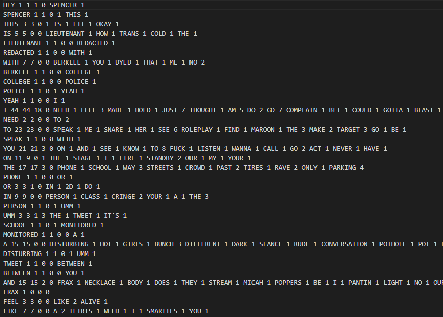
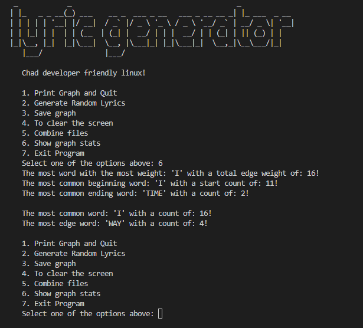

# Lyric Generator
<div align="center">
</img>
</div>
Lyric Generator is a C++ program, that takes a .txt file of lyrics and generates 
a new set of lyrics using markov chains. 

## Installation
### Prerequisites
#### Windows:
- A C++ compiler (e.g., MinGW-w64) 
- Make (e.g., GNU Make for Windows)
#### macOS:
- Xcode command-line tools
#### Linux:
- GCC or Clang compiler
- Make

### Installation Steps

#### Windows:
1. Install required tools: Ensure you have MinGW-w64 and GNU Make installed.
2. Open a terminal: Open a command prompt or Git Bash.
3. Navigate to project /bin/ directory.
4. Run make: make

#### macOS:
1. Install Xcode command-line tools: Open a Terminal and run xcode-select --install.
2. Navigate to project /bin/ directory.
3. Run make: make

#### Linux:
1. Install required tools: Ensure you have GCC or Clang and Make installed.
2. Navigate to project /bin/ directory.
3. Run make: make

## What is a markov chain 

A Markov Chain is a type of graph in which each vertex represents a word, and
the edges (directed and weighted) coming out of each vertex indicate how often
the other word came from that word. We load the graph using data from a corpus
of text, and the graph we get at the end of it can be used to generate new
sentences in the style of whatever we trained it with.
<div align="center">
	</img>
</div>
Markov chain is a specific type of finite state machine that is used to model 
probabilistic processes. Both Markov chains and finite state machines have a 
finite set of states and transitions between those states, but the difference 
is in how the transitions are determined.

Each node is created using these two structs, Edge and Vertex. 

```C++
//Custom data type: To hold words and weights 
struct Edge {
	std::string word; //The word we're connected to
	unsigned int weight = 0; //How often they follow us
};

//Adjacency List style graph
struct Vertex {
	std::string word; //What word this vertex corresponds to, like APPLE
	unsigned int count = 0; //How often this word came up
	unsigned int total_edge_weight = 0; //Total weight of the edges coming out of this vertex
	unsigned int start_count = 0; //How often this word starts a sentence
	unsigned int comma_count = 0; //How often the word has a comma following it
	std::vector<Edge> edges; //Holds the words we're connected to, and how often they follow us, like {PEAR,3}
};
```

### I loaded 500 lines of hyperpop lyrics and got this beautiful gem. 
- "I'M POGGERS."
- "I THOUGHT SOMEONE ELSE WAS ALL SNUGGLY."
- "NOW, NOW."
- "HIT THE BIG BOYS COMING WITH THE PAST FEW REASONS."
- "FANDOM WITH THE PICTURE."
- "BUT I GO INSANE RIGHT NOW, NOW."
- "GRASSI, GRASSI, GRASSI, THATS THAT FIFTH DIMENSION FOUR, I GOTTA GO, TO ROLEPLAY AND POPPERS."
- "BUT I JUST WANT YOU SEE."
- "I RIDE."
- "I GO GO ON YOUR RIDE."

The bigger the data set, the better the lyrics. Pretty intresting right, but what 
does this program actually do. 

#### The program can preform the following tasks: 
1. Loading Data and creating a graph.
2. Generate Random Sentences
3. Generate a cache file for quick data storage
4. Generate stats for the graph
5. Implement using object oriented programming
6. Implement operator overloading 
7. use #include "filesystem"
8. Combine graphs
9. Use a graph with adjacency lists

## 1. Loading Data and creating a graph.

So, this goes into a lot of string manipulation, I even made a header called 
String_Operations.hpp to help with this process. 

I feel like knowing regex, make the time complexity of the tokenization 
process a bit faster. 

So the process of reading goes like this, 
1. Take a whole line.
2. Strip all Quotations, Brackets, parentheses, and get rid of the words inbetween them.
3. Remove punctuation, commas, periods, exclmation points, etc.
4. Keep track if it has a comma with comma count, and if it starts or ends a sentance. 
5. Its splits here. If its new, we start at 6, if we seen it before we keep the index and stop here. 
6. Create the Vertex object, push it back into a vector, and keep track of the index
7. Hash the word as a key, into a assosative array map (Hash Table) and use the index as the value. 
8. Remember the index? This is were we add the weight and comma count.
9. If it was the first word of a sentance, add one to the total start count, and that vertex's start count.
10. if there was a previous word, we add the current word to the edge list with a word a weight.
11. if it already exists just add one to the weight. 

We do this one word at a time.

This creates the graph, using a adjacency list method. 

And finally prining the graph to the screen

<div align="center">
</img>
</div>

## 2. Generating Random Sentences

So let's say you're ready to generate a random sentence. There were 4 lines in
the input file, so you will do a "int roll = rand() % 4" to get a number from
0 to 3. You then will go through each vertex in the graph (in the order they
were entered, DON'T MESS WITH THE ORDERING) and subtract off the start_count
of each vertex. If the roll is then negative, that's your start. For example,
say you rolled a 2.
The first element in the graph is APPLE, APPLE has a start_count of 2, so the
roll is reduced by 2 to 0. 0 is not negative, so we keep going. We get to
TOMATO next, which also has a start count of 2, so we subtract off 2 from
roll, giving us -2. This means that TOMATO is the start of the sentence.

Cool. So we output "Tomato" to the screen.

Next, we need to figure out what word comes next. Tomato appeared 4 times in
the input, 2 times as the end of a sentence (50% chance), and 2 times leading
to other words (25% chance of APPLE, 25% chance of PEACH). So let's say we
roll another die, modulus the number of times TOMATO appears (4), and we get a 3.
We subtract off the number of times it ends a sentence, and the roll is now 1.
We subtract off the number of times APPLE follows from TOMATO, and we now
have 0. This is still not negative, so we continue. We subtract 1 off for
PEACH (since PEACH comes from TOMATO one time) and it goes negative, and so
PEACH is our next node in the graph. 

Cool. So we output " peach" to the screen, and continue with peach as the
current node in the graph.

PEACH appears one time in the graph, and so we roll rand() % 1, giving us
zero. We start by subtracting the number of times PEACH ended a sentence (1),
giving us a negative number. So that's our choice. We output ".\n" and are
done with this sentence.

Move on to the next sentence, and you'll all done.

## 3. Generate a cache file for quick data storage

The whole point of generating these cache files is to minimize the time needed to
use the data, it ususaly faster to use data that is already formated and ready to be inserted
into the graph than creating new data
<div align="center">
</img>
</div>

## 4. Generate stats for the graph

The whole goal of this function of the program is to show and describe the graph:
1. The word with the most weight
2. The most common beginning word
3. The most common ending word
4. the most common word
5. the most common edge word 
<div align="center">
</img>
</div>
## 5. Implement using object oriented programming

I personally have nothing to show for my CSCI-41, class which is the class where you learn how to 
use object oriented programming. I ended up refactoring this code to use that methodology. Using separate .cc files and object files and a makefile to complie the program. 

```C++
//OOP: Markov Chaining with adjacency list
class Markov_Chaining {
	private:
		std::unordered_map<std::string ,size_t> hash; //Holds the index (in vec) of each word we've read
		std::vector<Vertex> graph; //Holds each word and who it's connected to via adjacency list
		std::string source_file; //Holds the source of the file. 
		size_t total_start_count = 0; //Holds how many sentences we've read
		bool combined = false;
		bool cache_check(const std::string &);
	public:
		Markov_Chaining() = delete;
		Markov_Chaining(const std::string &);
		void save_file();
		void recover_graph();
		void build_graph(const std::string &);
		void stats_graph();
		void sentence_generation();
		size_t get_total_start_count() const { return total_start_count; }
		friend std::ostream &operator<<(std::ostream &outs, const Markov_Chaining &m);
};
```

## 6. Implement operator overloading 

C++ has the special ablity to overload certain operators
for this project in particular, I imagine overloading the 
<< operator would help with the printing, and show a use for it.

```C++
std::ostream& operator<<(std::ostream &outs, const Markov_Chaining &m) {
	for (const Vertex &v : m.graph) {
		outs << v;
	}
	outs << "\n\tTotal Start Count: " << m.total_start_count << std::endl;
	return outs;
}
```

## 7. use #include "filesystem"

using filesystem which isn't covered in any of the computer science classes, 
plus a nifty looking file explorer would be cool to implement. 
<div align="center">
</img>
</div>
## 8. Combine graphs

this part came from a issue I had with not being able to combine graphs for easy use, so I can get bigger data sets. which is baiscally the same as the contructor for the graph, but I had to use it a private function to 
be able to use it again for the adding the new graph.

## 9. Use a graph with adjacency lists

```C++
//OOP: Markov Chaining with adjacency list
class Markov_Chaining {
	private:
		std::unordered_map<std::string ,size_t> hash; //Holds the index (in vec) of each word we've read
		std::vector<Vertex> graph; //Holds each word and who it's connected to via adjacency list
		std::string source_file; //Holds the source of the file. 
		size_t total_start_count = 0; //Holds how many sentences we've read
		bool combined = false;
		bool cache_check(const std::string &);
	public:
		Markov_Chaining() = delete;
		Markov_Chaining(const std::string &);
		void save_file();
		void recover_graph();
		void build_graph(const std::string &);
		void stats_graph();
		void sentence_generation();
		size_t get_total_start_count() const { return total_start_count; }
		friend std::ostream &operator<<(std::ostream &outs, const Markov_Chaining &m);
};
```

Using a vector of vertexes, use it like a adjacency list to hold the edges we are connected to. this is a 
graph theory problem overall, and using this methology would help with the program. 

## Acknowledgements

 - [Read.h](https://github.com/ShakaUVM/read) "The best header known to man, to someday be in standard"
 - [Markov Chaining (to generate Fake Alex Jones)](https://youtu.be/DK_R1iMb9Wk)

Thank you, Professor Kerney for one of my favorite programing assignments, I can't wait to use this on my own students some day. 